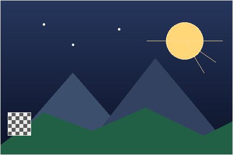

# sml-raster

A small, pure 2D rasterizer for Standard ML. It draws shapes — lines,
rectangles, circles, triangles, polygons — into the 8-bit RGBA image buffer
provided by [`sml-image`](https://github.com/sjqtentacles/sml-image), and
returns `Image.image` values you can encode to PNG/BMP/TGA/PNM.



*Generated by [`examples/shapes.sml`](examples/shapes.sml) (`make example`): a
gradient sky drawn straight into the buffer, then `fillCircle`/`circle`/`line`
(sun and rays), `fillTriangle` (mountains), `fillPolygon` (the hill), and
`blit` (the checkerboard), encoded to PNG with `Image.encodePng`.*

- Pure, functional public API: every op takes an `image` and returns a **new**
  `image`; inputs are never mutated.
- Efficient internals: each op materializes the pixel bytes into a mutable
  `Word8Array`, mutates while drawing, then freezes back to an immutable image.
- **Always clipped**: drawing partially (or fully) off-screen is safe and never
  raises — out-of-bounds pixels are silently skipped.
- Deterministic and byte-identical across **MLton** and **Poly/ML**.

## Primitives

All operations live in `structure Raster :> RASTER` and have the form
`image -> ... -> rgba8 -> image`.

| Operation     | Description                                            |
|---------------|--------------------------------------------------------|
| `blank`       | Make a solid `w*h` image (wraps `Image.fill`)          |
| `setPixel`    | Opaque write of one pixel (clipped)                    |
| `blendPixel`  | Alpha-over blend of one pixel against the existing one |
| `line`        | Bresenham line between two endpoints                   |
| `rect`        | Rectangle outline                                      |
| `fillRect`    | Filled rectangle                                       |
| `circle`      | Midpoint circle outline                                |
| `fillCircle`  | Filled circle (disk)                                   |
| `ellipse`     | Midpoint ellipse outline (radii `rx`, `ry`)            |
| `fillEllipse` | Filled ellipse, bounded by the midpoint outline        |
| `arc`         | Circular arc over an angular sweep (full turn = circle)|
| `triangle`    | Triangle outline                                       |
| `fillTriangle`| Scanline-filled triangle                               |
| `polyline`    | Connected sequence of line segments                    |
| `fillPolygon` | Scanline-filled polygon (even-odd rule)                |
| `blit`        | Copy a source image over the destination at an offset  |

### Coordinates and color

Images are RGBA8, row-major, top-left origin (matching `sml-image`). Colors are
`Image.rgba8` records: `{ r, g, b, a : Word8.word }`.

### Blending

`blendPixel` performs straight alpha-over compositing, rounded to nearest:

```
out = (src * a + dst * (255 - a) + 127) div 255
```

per channel, where `a` is the source alpha (`0`–`255`). The result alpha is
composited the same way against the destination alpha. An alpha of `255`
overwrites; an alpha of `0` leaves the destination unchanged.

### Ellipses and arcs

`ellipse`/`fillEllipse` draw a midpoint ellipse centered at `(cx, cy)` with
independent radii `rx`, `ry`; the filled variant is bounded exactly by the
outline. `arc` draws a circular arc of radius `r` over the counter-clockwise
sweep from `startAngle` to `endAngle` (radians, screen orientation: +x right,
+y down); a sweep of a full turn (`>= 2*pi`) draws the same pixels as `circle`.

```sml
val e = Raster.ellipse img { cx = 40, cy = 30, rx = 20, ry = 12 } red
val a = Raster.arc img
          { cx = 40, cy = 30, r = 20, startAngle = 0.0, endAngle = Math.pi } blue
```

## Signature

```sml
signature RASTER =
sig
  type image = Image.image
  type rgba8 = Image.rgba8

  val blank       : int * int -> rgba8 -> image
  val setPixel    : image -> int * int -> rgba8 -> image
  val blendPixel  : image -> int * int -> rgba8 -> image
  val line        : image -> {x0:int, y0:int, x1:int, y1:int} -> rgba8 -> image
  val rect        : image -> {x:int, y:int, w:int, h:int} -> rgba8 -> image
  val fillRect    : image -> {x:int, y:int, w:int, h:int} -> rgba8 -> image
  val circle      : image -> {cx:int, cy:int, r:int} -> rgba8 -> image
  val fillCircle  : image -> {cx:int, cy:int, r:int} -> rgba8 -> image
  val ellipse     : image -> {cx:int, cy:int, rx:int, ry:int} -> rgba8 -> image
  val fillEllipse : image -> {cx:int, cy:int, rx:int, ry:int} -> rgba8 -> image
  val arc         : image -> {cx:int, cy:int, r:int, startAngle:real, endAngle:real}
                      -> rgba8 -> image
  val triangle    : image -> (int*int)*(int*int)*(int*int) -> rgba8 -> image
  val fillTriangle: image -> (int*int)*(int*int)*(int*int) -> rgba8 -> image
  val polyline    : image -> (int*int) list -> rgba8 -> image
  val fillPolygon : image -> (int*int) list -> rgba8 -> image
  val blit        : image -> {dst:int*int, src:image} -> image
end
```

## Install

This package follows the standard `lib/github.com/<owner>/<repo>` vendoring
layout and depends on `sml-image` (whose own vendored `sml-inflate` and
`sml-color` cores are bundled here).

Reference the library MLB from your own build:

```
(* your sources.mlb *)
$(SML_LIB)/basis/basis.mlb
lib/github.com/sjqtentacles/sml-raster/sources.mlb
your-code.sml
```

`sml.pkg`:

```
package github.com/sjqtentacles/sml-raster
require {
  github.com/sjqtentacles/sml-image
}
```

## Usage

Draw a few shapes onto a white canvas and write a PNG:

```sml
fun rgba (r, g, b, a) : Image.rgba8 =
  { r = Word8.fromInt r, g = Word8.fromInt g,
    b = Word8.fromInt b, a = Word8.fromInt a }

val white = rgba (255, 255, 255, 255)
val red   = rgba (255,   0,   0, 255)
val blue  = rgba (  0,   0, 255, 255)
val green = rgba (  0, 200,   0, 255)

val img =
  let
    val c0 = Raster.blank (128, 96) white
    val c1 = Raster.fillRect c0 { x = 8, y = 8, w = 40, h = 30 } red
    val c2 = Raster.circle   c1 { cx = 90, cy = 30, r = 20 } blue
    val c3 = Raster.fillTriangle c2 ((20, 90), (60, 50), (100, 90)) green
    val c4 = Raster.line c3 { x0 = 0, y0 = 0, x1 = 127, y1 = 95 } (rgba (0,0,0,255))
  in c4 end

val png = Image.encodePng img
val os  = BinIO.openOut "out.png"
val ()  = BinIO.output (os, png)
val ()  = BinIO.closeOut os
```

Half-transparent overlay with `blendPixel`:

```sml
val shaded = Raster.blendPixel img (10, 10) (rgba (255, 255, 255, 128))
```

## Testing

The test suite asserts **exact** pixel values via `Image.getPixel` at known
coordinates, covering clipping, every primitive, the blend formula, and blit
edge-clipping.

```sh
make test        # MLton
make test-poly   # Poly/ML
make all-tests   # both
```

Both compilers report `106 passed, 0 failed`. The ellipse arc tests assert
that a full-turn `arc` produces a byte-identical framebuffer to `circle`, that
the rasterized `ellipse` is symmetric about both axes, and that `fillEllipse`
is bounded exactly by the outline.

## License

MIT
